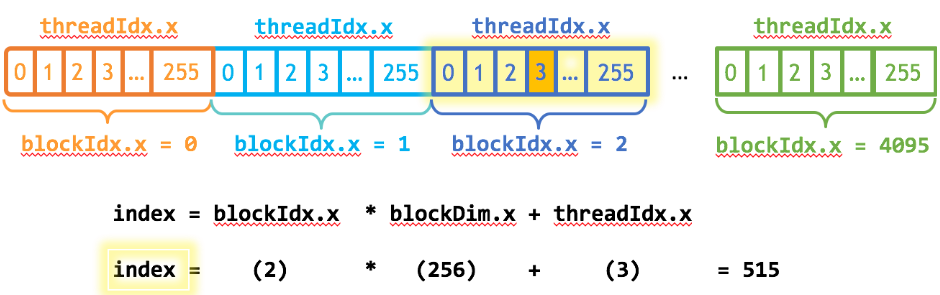
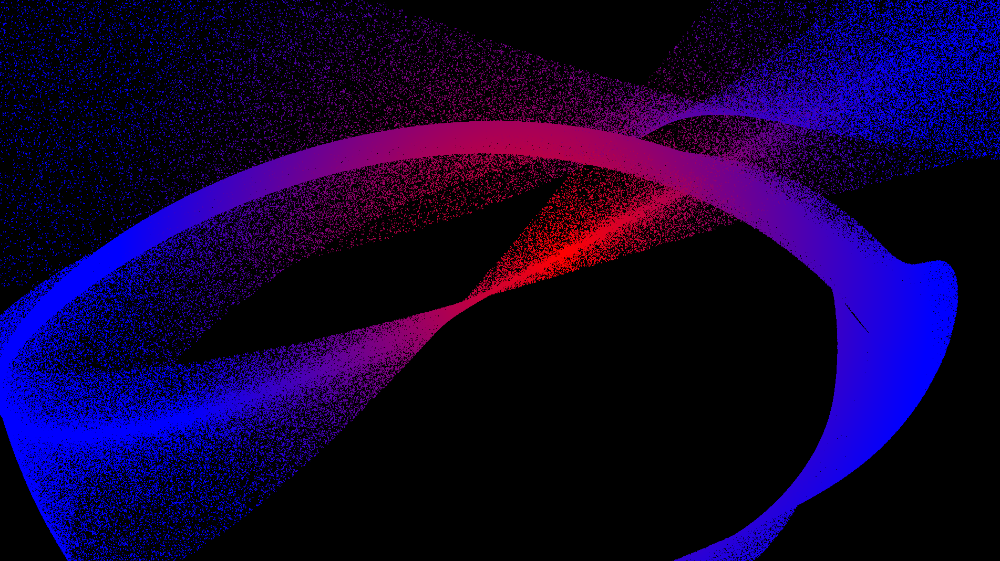
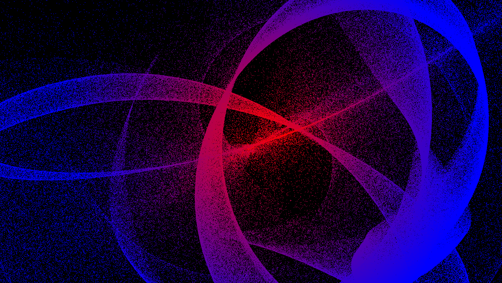
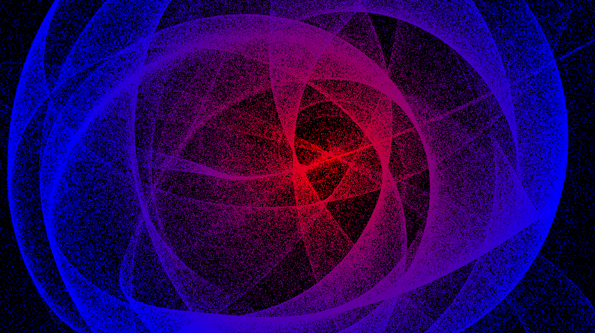

# particle_system
In this project, I implemented a particle system. A particle system is a technique in computer graphics used to simulate fuzzy or complex phenomena, such as smoke, fire, water, explosions, magic effects, and other fluid-like motions. Instead of rendering a single object, particle systems use a large number of small particles, each of which has its own properties like **position, velocity, color, size, and lifespan**. By simulating the movement and interactions of these particles, the overall effect can appear natural and dynamic.

In this project, more than **1 milloion** particles are moved according to **gravity**. To achieve this, I used **cuda** to speed up the process.

A video of the Particle system in action can be seen on YouTube.

[](https://www.youtube.com/watch?v=DB6TcMyBnC0)

<br></br>

## Particles
Each particle has the following information.

```
- Position(x,y)
- Velocity(v_x,v_y)
- Color(r,g,b)
```

At each frame, the acceleration is determined from the gravity point and each particle, and the velocity and position are updated. The gravity point can be changed by mouse cursor, and the color is changed according to the distance between the gravity point and the particle.

The accleleration is made to increase the farther away from the gravity point, referring to the gravity equation.

$$
F=G\frac{Mm}{r^2}
$$

Velocity and poisition are updated based on the laws of physics.

$$
\begin{align*}
velocity &= velocity + acceleration \times time \\
position &= position + velocity \times time
\end{align*}
$$

The colors are modified by changing the RGB values according to the following formula. *distance* is the distance between the gravity point and particle position, *maxDistance*
 means the distance that can be seen in the window, taking values from $-1$ to $1$, so the *maxDistance* is $\sqrt 2$.

$$
\begin{align*}
newColorValue &= min(distance/maxDistance, 1.0) \\
newColor &= (1.0 - newColorValue, 0.0, newColorValue);
\end{align*}
$$

<br></br>

## Cuda programming
When I ran it with **1 million** particles in my environment, it was about 7 fps, so I used cuda for the process of updating the parameters of the particles to speed up the speed to around **30 fps**.
I use a thread size of 256 and the number of blocks is calculated from the number of particles and the number of threads as follows.

$$
blocks = (particleNumber + threads - 1) / threads
$$

I used the following formula to get the current index in the process using cuda. Below image helps you to understand.

$$
index = blockIdx.x \times blockDim.x + threadIdx.x
$$



The accelerated code is show below.

```c++
__global__ void update_particle_kernel(glm::vec2 *cu_position, glm::vec2 *cu_velocity,
                                       glm::vec3 *cu_color, glm::vec2 gravity_pos, float delta_time,
                                       float aspect_ratio, int num_particles, float max_distance, float gravity_strength) {
    // Get current index
    int idx = blockIdx.x * blockDim.x + threadIdx.x;
    if (idx >= num_particles) {
        return;
    }

    // Update velocity and position
    glm::vec2 rescaled_pos = cu_position[idx];
    rescaled_pos.x /= aspect_ratio;
    glm::vec2 accel = gravity_pos - rescaled_pos;
    glm::vec2 upscale_accel = accel * glm::length(accel) * gravity_strength;
    cu_velocity[idx].x += upscale_accel.x * delta_time;
    cu_velocity[idx].y += upscale_accel.y * delta_time;
    cu_position[idx].x += cu_velocity[idx].x * delta_time * aspect_ratio;
    cu_position[idx].y += cu_velocity[idx].y * delta_time;

    // Update color
    float new_color_val = fminf(glm::length(accel) / max_distance, 1.0f);
    cu_color[idx] = glm::vec3(1.0f - new_color_val, 0.0f, new_color_val);
}
```

The code calling the above process is as follows.

```c++
update_particle_kernel<<<this->blocks, this->threads>>>(
        this->cu_position, this->cu_velocity, this->cu_color, this->gravity_pos, delta_time,
        aspect_ratio, this->position.size(), this->max_distance, this->gravity_strength);
```

<br></br>

## How to create an environment
First, you have to install cuda. I have confirmed that it works with cuda 11.8.  
After that, you can run the following command to create an environment.

```bash
bash setup.sh
```

<br></br>

## How to run
You can compile the source code and run by running following commands.

```bash
cd srcs
make
./particle_system
```

The number of particles, particle radius, and the strength of gravity can be changed with the arguments.

```bash
./particle_system [number of particles] [particle radius] [strength of gravity]
```

The default settings are as follows.

```
- Number of particles -> 1000000
- Particle radius -> 0.003
- Strength of gravity -> 2.0
```

The default gravity point is $(0,0)$, but by pressing `s`, the mouse cursor position becomes the gravity point. To stop positioning with the mouse cursor, press `s` again.

<br></br>

## Beautiful particles







<br></br>

## References
- [An Even Easier Introduction to CUDA](https://developer.nvidia.com/blog/even-easier-introduction-cuda/)
- [CUDA C++ Programming Guide](https://docs.nvidia.com/cuda/cuda-c-programming-guide/)
- [Particle system](https://en.wikipedia.org/wiki/Particle_system)
